# 🎯 D.A.R.T. — DataOps Autonomous Reliability Team

<div align="center">


**The AI-Driven On-Call Crew Behind Your Most Robust Pipelines.**

[](https://www.python.org/)
[](https://www.docker.com/)
[](LICENSE)
<!-- []() -->
[▶️ Watch 3-minute demo on YouTube](https://youtu.be/YOUR_VIDEO_ID)

Built for [Agents Intensive - Capstone](https://www.kaggle.com/competitions/agents-intensive-capstone-project) submission in **Enterprise Agents**
Track for the [**5-Day AI Agents Intensive Course with Google**](https://www.kaggle.com/learn-guide/5-day-agents).
</div>

---
<a id="top"></a>
## 📚 Table of Contents

- [🚨 The $12.9M Problem: Data Downtime](#the-129m-problem-data-downtime)
- [🛡️ The Solution: Autonomous Reliability](#the-solution-autonomous-reliability)
- [🌟 Key Capabilities](#key-capabilities)
- [🧬 What Makes D.A.R.T. Different](#what-makes-dart-different)
- [🏗️ System Architecture](#system-architecture)
  - [The system is composed of five distinct planes](#the-system-is-composed-of-five-distinct-planes)
- [🧩 Agentic Concepts & Primitives](#agentic-concepts--primitives)
- [🚀 The Project Journey](#the-project-journey)
  - [From Reactive Firefighting to Autonomous Intelligence](#from-reactive-firefighting-to-autonomous-intelligence)
  - [How D.A.R.T. Was Built](#how-dart-was-built)
  - [Where This Journey Landed](#where-this-journey-landed)
  - [Limitations & Future Work](#limitations--future-work)
- [🚀 Deployment & Reproducibility Guide](#deployment--reproducibility-guide)
  - [1. Prerequisites](#1-prerequisites)
  - [2. Recommended: Docker Deployment (One-Command Setup)](#2-recommended-docker-deployment-one-command-setup)
  - [3. Local Development (Python Runtime)](#3-local-development-python-runtime)
  - [4. Backend-Only Mode (No UI)](#4-backend-only-mode-no-ui)
  - [Deployment Summary](#deployment-summary)
- [📜 License](#license)

---
## 🚨 The $12.9M Problem: Data Downtime

In the modern enterprise, data pipelines are the central nervous system, yet they remain dangerously fragile. "Data Downtime" periods when data is missing, erroneous, or stale: is an existential threat to data-driven organizations.


**The Real-World Cost (2025 Statistics):**
* **30% of Engineering Time is "Toil":** Despite AI advancements, the median time engineers spend on manual, repetitive operational work has *increased* to 30% in 2025 (Source: [Catchpoint SRE Report 2025](https://www.catchpoint.com/press-releases/the-sre-report-2025-highlighting-critical-trends-in-site-reliability-engineering)).
* **$12.9 Million** is the average annual cost of poor data quality to enterprises (Source: [Gartner](https://www.gartner.com/en/data-analytics/topics/data-quality?utm_term=1739983492&utm_campaign=SM_GB_YOY_GTR_SOC_SF1_SM-SWG-CP-GTS-IT&utm_source=linkedin&utm_medium=social&utm_content=Gartner+for+IT)).
* **$100k+ Per Outage:** In 2025, 100% of enterprises reported revenue loss from outages, with one-third losing between **$100,000 and $1 Million per single event** (Source: [Cockroach Labs State of Resilience 2025](https://www.cockroachlabs.com/blog/the-state-of-resilience-2025-reveals-the-true-cost-of-downtime/)).
* **166% Slower TTR:** The time-to-resolution for data incidents has spiked by 166% as pipeline complexity outpaces human ability to diagnose errors (Source: [Integrate.io Data Engineering Benchmarks](https://www.integrate.io/blog/data-pipeline-efficiency-statistics/)).

Production pipelines fail in ways humans cannot triage fast enough: schema drift, bad code pushes, flaky vendor APIs, and silent data corruption. On-call engineers lose hours validating, diagnosing, and patching, often waking up at 3 AM to fix a simple column rename. 
<p align="right"><a href="#top">⬆️ Back to top</a></p>

--- 
## 🛡️ The Solution: Autonomous Reliability

**D.A.R.T.** is a multi-agent, self-healing copilot designed to reclaim that lost engineering time. It acts as an autonomous "Level-1 Responder" that detects, diagnoses, and repairs data pipeline incidents with **Human-In-The-Loop (HITL)** safety.

Unlike simple scripts, D.A.R.T. is an **Agentic Mesh** that runs fully autonomously negotiating with vendors, writing SQL, and generating GitOps PRs, stopping only when safety protocols require your approval. 
<p align="right"><a href="#top">⬆️ Back to top</a></p>
---
## 🌟 Key Capabilities

D.A.R.T. solves complex data operations challenges through a highly engineered multi-agent mesh.

### ☕ A 2:03 AM Incident, End-to-End

Imagine the nightly `finance_pipeline.daily_sales_load` DAG fails at 2:03 AM:

1. **Alert fires** – Airflow / monitoring reports a critical failure on the sales pipeline.
2. **Syx (Commander)** spins up a mission and fans out:
   - **Neon** scrapes logs, schema registry, and recent Git diffs.
   - **Echo** calls the vendor API, which confidently reports “ALL GREEN”.
3. **Evidence conflict** – Neon sees `SALES_DATA` has 5 columns, but today’s CSV has 6 (`currency_code` added). Echo still insists the vendor is healthy.
4. **Kai (Engineer)** drafts a remediation:
   - Generate an `ALTER TABLE` to add `currency_code`
   - Update downstream aggregations that group by currency.
5. **Shield (Safety)** blocks the DDL until a human approves:
   - Shows the full SQL diff, impact analysis, and rollback plan in the UI.
6. **You (On-Call)** skim the mission summary, approve the patch, and D.A.R.T. executes it.
7. **Mission closes** with a postmortem:
   - Root cause, blast radius, applied fix, vendor “truth vs reality”, and token/cost stats.

The sections below break down *how* each capability contributes to this flow.

### 1. 🎼 Hierarchical Swarm Orchestration
* **The Problem:** Manual triage of pipeline failures is slow, linear, and error-prone.
* **The Solution:** A **Multi-Agent Mesh** architecture where **Syx (Commander)** orchestrates specialized sub-agents. Syx executes a sequential strategic loop while launching **Neon (Auditor)** and **Echo (Liaison)** for parallel evidence gathering, significantly reducing Time-to-Diagnosis (TTD).
* **🧩 Agentic Patterns & Primitives:** `LLM-powered agents`, `Parallel & Sequential Coordination`, `Loop Agent (Retries)`, `Long-running Ops`, `Agent-to-Agent Protocol`.

### 2. 🔍 Hybrid Root Cause Analysis (RCA)
* **The Problem:** Root causes are often hidden in noisy contexts (e.g., silent drift, vendor flakiness).
* **The Solution:** **Neon** performs **Hybrid Analysis**, combining deterministic Regex patterns for known errors with probabilistic LLM reasoning for novel issues. It integrates data snapshots via MCP and external research via Google Custom Search.
* **🧩 Agentic Patterns & Primitives:** `Custom Tools (Regex/KB)`, `MCP Tools (Logs/SQL)`, `OpenAPI Tools (Google Search)`, `Observability`.

### 3. 🛡️ Deterministic Safety Gates (HITL)
* **The Problem:** Autonomous agents risk executing destructive commands (e.g., `DROP TABLE`) without oversight.
* **The Solution:** **Shield (Safety)** acts as a policy-enforcement layer. It scans all SQL and Git diffs generated by Kai against a strict risk heuristic. High-risk actions force a **Human-in-the-Loop (HITL)** interruption via the Chainlit UI, pausing the thread until approval is granted.
* **🧩 Agentic Patterns & Primitives:** `HITL Safety`, `Custom Risk Scanning`, `Long-running Pause/Resume`, `Observability (Audit Trail)`.

### 4. 🔄 Resilience & Transient Failure Handling
* **The Problem:** Flaky vendor APIs and intermittent network issues cause false positives.
* **The Solution:** **Echo** implements **Exponential Backoff** algorithms to handle vendor instability. Syx utilizes a global retry loop, attempting missions multiple times with increasing context before escalating to human intervention.
* **🧩 Agentic Patterns & Primitives:** `Loop Agent`, `Retry/Backoff Patterns`, `Resilience Engineering`, `Observability (Loop Counts)`.

### 5. 🧠 Semantic Memory & Context Optimization
* **The Problem:** Long error logs exceed token limits and dilute model reasoning.
* **The Solution:** D.A.R.T. employs **Context Compaction**, summarizing raw logs into dense vector representations. **ChromaDB** provides long-term semantic memory, allowing Syx to recall and apply successful fixes from past incidents (0-Shot Resolution).
* **🧩 Agentic Patterns & Primitives:** `Sessions & State Management`, `Long-term Memory (Vector)`, `Context Optimization`, `MCP Data Tools`.

### 6. 🕵️ Proactive Anomaly Detection
* **The Problem:** "Silent Failures" occur when data is missing but no alerts are triggered.
* **The Solution:** The **Observability Guard** mission proactively scans for statistical anomalies using MCP tools. Shield enforces valid data thresholds, ensuring pipeline integrity even in the absence of explicit error logs.
* **🧩 Agentic Patterns & Primitives:** `MCP Tools`, `Custom Detection Logic`, `Observability (Metrics)`, `Agent Evaluation`.

### 7. 🤥 Deception Detection & Verification
* **The Problem:** External vendors often report "All Systems Operational" during active outages.
* **The Solution:** **Echo** implements a **Lie Detection Protocol**, cross-referencing vendor status API responses against internal failure evidence collected by Neon. Inconsistencies trigger an immediate escalation to Syx.
* **🧩 Agentic Patterns & Primitives:** `Parallel Agents`, `Agent-to-Agent (A2A) Protocol`, `Cross-System Verification`.

### 8. 📚 Autonomous Research & Knowledge Retrieval
* **The Problem:** Novel error codes (e.g., Snowflake `100071`) often lack internal runbooks.
* **The Solution:** When internal heuristics fail, Kai activates the **KB Lookup Protocol**. It utilizes Google Custom Search and internal Knowledge Base tools (via MCP) to research error codes, synthesize documentation, and draft a fix.
* **🧩 Agentic Patterns & Primitives:** `OpenAPI Tools (Search)`, `Knowledge Base Integration`, `Autonomous Research`, `LLM Reasoning`.

### 9. 📊 Tokenomics & ROI Telemetry
* **The Problem:** Engineering teams need to justify the cost and efficacy of AI tools.
* **The Solution:** The **Mission Control** dashboard provides real-time telemetry, reporting Time-to-Resolution (TTR), estimated token costs, loop attempts, and HITL events. All actions are logged to `trace_viz` for auditability.
* **🧩 Agentic Patterns & Primitives:** `Observability (Tracing/Metrics)`, `Agent Evaluation`, `Session Tracking`, `ROI Analysis`. 
<p align="right"><a href="#top">⬆️ Back to top</a></p>

---
## 🧬 What Makes D.A.R.T. Different

D.A.R.T. is not just “an agent that calls tools”, it is designed as a reliability copilot for real production data pipelines:

- **DataOps-native focus** – Built around concrete incident types: schema drift, bad commits, flaky vendors, blind dashboards, and partial outages in nightly/near-real-time jobs.
- **Deception-aware reasoning** – Echo cross-checks vendor “ALL GREEN” claims against logs and DAG failures, and Syx treats disagreements as first-class evidence instead of assuming external APIs are honest.
- **Dual-plane remediation** – Kai can propose both runtime fixes (SQL patches, backfills) and **GitOps PRs** (config / DAG / logic diffs), so you choose between hotpatching and permanent repair.
- **Safety-first autonomy** – Shield enforces policy on any destructive action (DDL, deletes, heavy backfills) with HITL approvals, rollback plans, and simulation-only dry runs before touching production.
- **Mission-level memory & evaluation** – Every incident becomes a structured mission record with agents involved, time-to-resolution, tokens used, and outcome; repeated failures can be fast-pathed and measured.
- **Tokenomics built-in, not bolted on** – Context compaction, capped fan-out, and per-mission cost summaries make it safe to run D.A.R.T. continuously in a noisy, real-world environment.

These are the design constraints that shaped the architecture you’ll see in the next section.
<p align="right"><a href="#top">⬆️ Back to top</a></p>

---
## 🏗️ System Architecture

D.A.R.T. utilizes a micro-service architecture wrapped in a monolithic Docker container for ease of deployment. It decouples the "Brain" (Agents) from the "World" (Mock Enterprise) to ensure safe, reproducible demos.

```mermaid
---
config:
  layout: elk
  theme: neo
---
flowchart TB
 subgraph UI["Chainlit UI"]
        A["Mission Buttons / Alerts"]
        B["Renderers<br>Dataframes • Diffs • Context Audit • Tokenomics"]
        C["HITL Actions"]
  end
 subgraph Control["Syx (Commander)"]
        S1["Observe Logs & Vendor"]
        S2["Decide Loop / Fast Track"]
        S3["Act: invoke Kai/Shield/Echo"]
        S4["Learn: store incident"]
  end
 subgraph Evidence["Neon (Auditor)"]
        N1["Fetch Logs/Schema/Data"]
        N2["Regex + Gemini"]
        N3["KB + Google Search Tool"]
        N4["Context Tables/Data Snapshot"]
  end
 subgraph EchoAgent["Echo (Vendor Liaison)"]
        E1["Vendor A2A Calls"]
  end
 subgraph Remediation["Kai + Shield"]
        K1["Kai: SQL Patch / Git PR"]
        K2["Shield: Policy Scan + HITL"]
        K3["Deploy SQL or Open PR"]
  end
 subgraph Infra["MCP Server & Vendor"]
        M1["MCP Tools<br>logs/schema/data/table header"]
        M2["Git/Jira mocks"]
        M3["Knowledge Base"]
        M4["Google Custom Search - OpenAPI"]
        V1["Echo→Vendor FastAPI"]
  end
 subgraph Memory["Chroma Store"]
        R1["Incident Vector DB"]
  end
    A -- Alert --> Control
    Control -- Parallel --> Evidence & EchoAgent
    Evidence -- Context --> Control
    EchoAgent -- Vendor Signal --> Control
    Control -- Loop Decision --> Remediation
    Remediation -- SQL/PR Plan --> Control
    C -- Approve/Block --> Remediation
    Control -- Logs & Tables --> UI
    Evidence -- Tables --> UI
    Remediation -- Git Diff / Receipt --> UI
    Control -- Store/Query --> Memory
    Evidence -- Tools --> Infra
    Remediation -- MCP/Git/Jira --> Infra
    EchoAgent -- A2A --> V1
    V1 -- Status --> Control
    Control --> n1["Untitled Node"] & n2["Untitled Node"]
    style Control fill:#C8E6C9
    style Evidence fill:#FFE0B2
    style EchoAgent fill:#B3E5FC
    style Remediation fill:#FFF9C4
    style UI fill:#E1BEE7
    style Memory fill:#757575
    style Infra fill:#FFCDD2
```


### <center>D.A.R.T. Runtime Architecture: Components, Agents, and Data Exchange</center>

---
### The system is composed of five distinct planes.
### 1. 🖥️ The Experience Plane (Chainlit UI)
The "Glass Box" interface that provides transparency into the agent's reasoning.

* **A. Mission Control Console:**
    * **Mission Buttons / Alerts (A):** Interactive actions that launch 8 predefined scenarios (Drift, Lie Detection, Memory Recall) and push critical system notices.
    * **System Readiness:** Real-time status board preparing the roster and environment.
    * **Module Logic:** Package markers organizing UI modules for clean imports.
* **B. Rich Artifact Renderers:**
    * **Dataframes:** Interactive Pandas tables for "Before/After" data verification.
    * **GitOps Diffs:** Syntax-highlighted code diffs for PR reviews.
    * **Context Audit:** Visual comparison of raw logs vs. compacted context (proving token efficiency).
    * **Tokenomics (B):** Cost/Efficiency summaries generated by `utils/evaluation.py`.
* **C. HITL Actions:**
    * **HITL Actions (C):** A blocking modal that intercepts high-risk operations (as flagged by Shield), enforcing human authorization via `cl.AskAction` before execution.

### 2. 🧠 The Orchestration Plane (Control)
The central nervous system managing the OODA Loop (Observe, Orient, Decide, Act).


### <center>Agentic Workflow</center>

* **Syx: The Commander (Orchestration):**
    * **Observe Logs & Vendor:** Aggregates evidence from Neon and health signals from Echo to form a holistic view of the incident.
    * **Decide Loop / Fast Track:** Executes the decision loop. Dynamically chooses between parallel evidence gathering, recursive retries, or short-circuiting to remediation based on confidence scores.
    * **Act (Invoke Kai/Shield):** Routes commands to the specialized swarm (Kai for fixing, Shield for policy).
    * **Learn (Store Incident):** Commits successful resolutions to **ChromaDB** vector memory and updates the session state for observability.

### 3. 🐝 The Execution Plane (The Swarm)
Specialized autonomous agents performing domain-specific tasks.

* **Neon: The Auditor (Diagnostics)**
    * **Fetch Logs/Schema/Data:** Invokes MCP primitives to fetch raw logs, schema definitions, **table headers**, and data samples.
    * **Regex + Gemini:** Performs a two-stage diagnosis: deterministic Regex scanning for known signatures, followed by LLM (Gemini) reasoning.
    * **KB + Google Search Tool:** Queries the Knowledge Base and Google Custom Search (OpenAPI) to validate error codes.
    * **Context Tables/Data Snapshot:** Synthesizes raw telemetry into dense "Context Tables" to minimize token load.

* **Kai: The Engineer (Remediation)**
    * **SQL Patch / Git PR:** Determines the optimal fix path: **Runtime SQL Patch** (for data) or **GitOps Pull Request** (for logic). Generates diffs and parses tool output.
    * **Iterative Error Recovery:** If a drafted patch fails validation or execution (e.g., Syntax Error), Kai autonomously analyzes the traceback, refactors the code, and attempts a correction loop before failing over to human escalation.
    * **Deploy SQL or Open PR:** Executes approved SQL via MCP or stages GitOps changes (using Mock Git/Jira tools), handing "Receipts" back to Syx/UI.

* **Shield: The Safety Officer (Governance)**
    * **Policy Scan + HITL:** Scans all generated SQL/Code against a strict heuristics engine to detect destructive patterns (e.g., `DROP`, `DELETE`). Intercepts execution to force HITL approval for risky changes.
    * **Risk Classification Matrix:** Categorizes operations into "Standard" (Auto-Approve) and "Critical" (HITL) tiers. For example, a `CREATE VIEW` is auto-approved, while an `ALTER TABLE` triggers a gate.
    * **Immutable Compliance Audit:** Logs every policy decision (Block vs. Allow) and the associated human rationale (if HITL was triggered) to the Trace Logger, ensuring full auditability of autonomous actions.

* **Echo: The Liaison Client(Resilience)**
    * **Vendor Liaison Client:** alls the VendorBot (A2A) endpoints, runs health/deception checks with retry/backoff, and feeds vendor signals back to Syx.
    * **Agent-to-Agent (A2A):** Manages the interface with external bots (VendorBot), strictly decoupling internal logic from external dependencies.
    * **Echo→Vendor FastAPI:** Hits the VendorBot simulation with backoff and deception checks.

### 4. 🔌 The Infrastructure Plane (MCP, Memory & Simulation)
The backing stores and simulated enterprise environment.

* **MCP Tools (Logs/Data/Headers):** FastMCP endpoints providing high-fidelity simulations of Snowflake-like data access: logs, schemas, **table headers**, and data samples.
* **Git/Jira Mocks:** Mock tooling for Pull Request creation and Ticket Receipts used in GitOps flows.
* **Knowledge Base:** An internal RAG source for retrieving runbooks.
* **Google Custom Search (OpenAPI):** HTTP/OpenAPI integration for resolving "Unknown Unknowns."
* **VendorBot Simulation:** A standalone FastAPI service acting as an external dependency. Features configurable "Flaky" and "Lying" modes.
* **Incident Vector DB:** **ChromaDB** persistent store for post-mortems. Stores embeddings and metadata (incident_id, root cause, fix type).
* **MCP Client:** A custom lightweight SSE client that extracts JSON payloads for the agents.

### 5. 📊 The Observability & Reliability Plane
Ensures the system is auditable, measurable, and reliable.

#### **Logging & Bridging**
* **Trace Logger (`utils/trace_viz.py`):** A Rich-text structured logger that captures the agent's "Thought Process," tagging every step with Incident IDs.
* **UI Bridge (`ui/bridge.py`):** A real-time mirroring service that pipes backend trace logs and thought chains directly into the Chainlit UI stream.

#### **Telemetry & Evaluation**
* **Mission Metrics (`utils/evaluation.py`):** Real-time calculation of ROI metrics: Time-to-Resolution (vs Human Baseline), Token Cost, Loop Count, and Vendor Status.

#### **Resilience Utilities**
* **Retry/Backoff (`utils/retry_utils.py`):** Exponential backoff decorator for async functions (used by Echo) to survive flaky vendors.
* **Reset (`utils/reset.py`):** Utilities to wipe Vector Memory and logs, ensuring clean-slate reproducibility for demos. <p align="right"><a href="#top">⬆️ Back to top</a></p>
---
## 🧩 Agentic Concepts & Primitives  
D.A.R.T. (DataOps Autonomous Reliability Team) implements a full spectrum of **agentic capabilities** including multi-agent orchestration, standardized tooling via MCP, persistent memory, structured evaluation, and robust agent-to-agent communication aligned directly with the Agents Intensive Capstone requirements.

Below is an overview of the core architectural primitives and how they operate in concert.

---

### **1. Multi-Agent Mesh Architecture (Parallel, Sequential & Loop Patterns)**  
D.A.R.T. is designed as a **true multi-agent system**, not a linear chain.  
Syx (Commander) dynamically orchestrates the mission lifecycle using:

- **Parallel Agent Execution** to “fan out” diagnostic tasks. Neon (Auditor) and Echo (Vendor Liaison) run concurrently to reduce MTTR.  
- **Sequential Reasoning** for root-cause interpretation and final decision making.  
- **Loop Agent Behavior** to iteratively refine remediation attempts with expanded context until a validated, safe fix is achieved.

This reflects the project’s emphasis on **agent types, planning structures, and collaborative multi-agent operation**.

<details><summary>📸 View Evidence</summary>
<div align="center">


<div align="center">
</details>

---

### **2. Universal Tooling Layer (MCP, OpenAPI & Custom Tools)**  
D.A.R.T. integrates a **Universal Tool Interface**, leveraging:

- **Model Context Protocol (MCP)** for standardized access to enterprise systems (e.g., Snowflake-style query tools, CI/CD simulators, observability APIs).  
- **OpenAPI Tools** for external research and information retrieval.  
- **Custom Tools** (schema drift analyzers, Git diff renderers, SQL validators) purpose-built for DataOps scenarios.  
- **Long-Running Operations (LRO)** enabling the system to pause mid-mission during HITL (Human-in-the-Loop) checkpoints and resume seamlessly.

This demonstrates strong coverage of the rubric’s **tool interoperability and extended tool schemas**.

<details><summary>📸 View Evidence</summary>

<div align="center">


<div align="center">

</details><p align="right"><a href="#top">⬆️ Back to top</a></p>

---

### **3. Cognitive Persistence (Sessions & Long-Term Memory)**  
D.A.R.T. maintains **two independent planes of state**:

- **Session Memory**: Tracks dialogue, tool traces, evidence, and mission context within Chainlit.  
- **Long-Term Memory (LTM)**: Backed by ChromaDB, storing post-mortem embeddings for retrieval.  

Upon repeated incidents, Syx performs a vector search that enables **Zero-Step or Few-Shot Resolution**, bypassing full diagnostics by recalling prior successful fixes.

This satisfies the requirement for **session persistence, memory services, and retrieval-augmented reasoning**.

<details><summary>📸 View Evidence</summary>

<div align="center">


<div align="center">

</details>

---

### **4. Context Optimization & Compaction**  
To manage large, noisy telemetry streams without exceeding model context limits, D.A.R.T. performs:

- **Context Filtering** to isolate meaningful signals.  
- **Semantic Log Summaries** generated by Neon.  
- **Evidence Snapshots** (compressed table schemas, error deltas, signature frames).  

This ensures the LLM receives dense, high-signal input aligned with the rubric’s requirement for **context engineering and prompt compaction**.

<details><summary>📸 View Evidence</summary>

<div align="center">


<div align="center">

</details>

---

### **5. Full-Stack Observability & Traceability**  
D.A.R.T. provides **deep visibility** into agent reasoning and system operations:

- Real-time **Trace Logging** for thoughts, actions, and evidence merges.  
- **Tokenomics Metrics** including usage, duration, retries, and cost per mission.  
- **Inline Artifact Rendering** for Git diffs, SQL receipts, and remediation plans.  
- **Run-Level Audit Trails** for reproducibility and compliance.

This satisfies the competition requirement for **agent observability, transparency, and evaluation-friendly outputs**.

<details><summary>📸 View Evidence</summary>

<div align="center">


<div align="center">

</details>

---

### **6. Automated Mission Evaluation Framework**  
Each mission concludes with a structured **Mission Summary**, evaluating:

- Mission success/failure  
- Diagnostic completeness  
- Vendor subsystem status  
- HITL intervention records  
- Remediation confidence  

These summaries feed into a **Scenario Regression Deck**, enabling deterministic replay of engineered failure cases (drift, bad logic, vendor deception, novel errors, etc.).

This directly demonstrates the rubric’s requirement for **evaluation and mission scoring**.

<details><summary>📸 View Evidence</summary>

<div align="center">


<div align="center">

</details>

</details>

---

### **7. Resilient Agent-to-Agent (A2A) Protocol**  
Echo, the Vendor Liaison Agent, communicates with external Vendor Bots through a hardened **A2A protocol**:

- **FastAPI-based agent endpoints**  
- **Exponential Backoff and retries** for unstable vendor channels  
- **Cross-Verification** of vendor claims against internal evidence  
- **Deception Detection** when vendor responses conflict with audit telemetry  

This aligns with the rubric’s requirement for **agent-to-agent communication patterns and distributed reasoning**.

<details><summary>📸 View Evidence</summary>

<div align="center">


<div align="center">

</details>

---

### **8. 🚀 **Advanced Capabilities & Bonus Features**  
Beyond the core rubric requirements, D.A.R.T. includes a series of production-grade extensions:

- **Dual-Mode Remediation Engine**  
Supports both **Runtime SQL Fixes** and **GitOps Pull Requests**, each pre-validated through Shield’s Safety Policy Engine.

- **Omni-Channel HITL Safety**  
Safety protections apply across both UI and CLI entry points, ensuring destructive actions are blocked consistently regardless of interface.

- **One-Command Deployment**  
Includes a reproducible Dockerized environment with a single orchestrator script (`run_local.sh`) that launches the Agent Mesh, MCP Server, Vendor Bot, and Memory DB in one step.

- **Simulation Deck (Mission Library)**  
Ships with a curated set of eight engineered test scenarios covering Drift Triage, Broken Logic, Vendor Deception, Infinite Loops, Telemetry Storms, Silent Failures, Novel Snowflake-like Errors, and Memory-Recall missions.

<details><summary>📸 View Evidence</summary>

<div align="center">


<div align="center">

</details>

<p align="right"><a href="#top">⬆️ Back to top</a></p>

---
# 🚀 The Project Journey  
## From Reactive Firefighting to Autonomous Intelligence

Every data engineer knows the pain: a schema shifts at 2 AM, a vendor API mutates silently, a bad commit slips into production, or a pipeline enters a failure loop with no logs to explain why.

For years, I patched these failures with ad-hoc diagnostics and late-night fixes.  
D.A.R.T. began as that personal backlog, a survival kit for firefighting chaos.

The **Google x Kaggle Agents Intensive** transformed that chaos into architecture.  
It provided the vocabulary and the primitives needed to turn scattered scripts into a **coherent, agent-driven reliability system**:  
formal roles, protective safety nets, standardized tools, and the OODA loop as an operational backbone.

What started as firefighting has evolved into *autonomy*. Throughout this build, Gemini 3 Pro served as my dedicated pair-programmer. When I hit recursive tool loops, conflicting agent states, or opaque error traces buried in Chainlit/MCP callbacks, Gemini helped me reason through dead ends, validate architectural decisions, and stabilize the multi-agent execution model.  
Its iterative guidance turned what would have been weeks of debugging into a focused, structured engineering process.

### 🎓 Key Learnings from the 5-Day Agents Intensive

The course didn’t just give me “inspiration”; it rewired how I think about agents and infrastructure.  
A few concrete shifts that directly shaped D.A.R.T.:

1. **From “one big agent” to a cast with roles**  
   *Before:* A single oversized agent prompt trying to do everything.  
   *After:* A named swarm, **Syx, Neon, Kai, Shield, Echo** - each with a narrow, testable contract.  
   This made it much easier to reason about failures (“Neon misdiagnosed logs” vs “the LLM was wrong”).

2. **From ad-hoc helpers to a proper tool / MCP boundary**  
   *Before:* Direct DB/API calls baked into agent code.  
   *After:* A clean **MCP tool layer**: logs, schema registry, vendor A2A, Google Search, KB, Git/SQL actions.  
   Tools became the “physics of the world”; agents became policy and strategy on top of that.

3. **From stateless prompts to mission memory**  
   *Before:* Every incident was handled like a brand-new failure.  
   *After:* **ChromaDB-backed long-term memory** and structured incident summaries, enabling:
   - Zero-step recall for repeated failures  
   - Fast-path plans that reuse known-good remediations  
   - Better postmortems and learning over time  

4. **From print-debugging to observability and evaluation**  
   *Before:* Scattered logs and intuition about whether an agent “felt smart”.  
   *After:* Structured **trace logging**, **mission metrics**, and **tokenomics per run**:
   - Which agents were called, in what order  
   - How much context they consumed  
   - How long a mission took vs a human baseline  

5. **From “let the agent fix it” to safety-first autonomy**  
   *Before:* Tempting to let the model execute SQL/DDL directly once the diagnosis looked correct.  
   *After:* A hard rule: **Shield sits between any destructive action and production**, with:
   - Policy checks (e.g., no direct `ALTER TABLE` on fact tables)  
   - HITL approvals with full diffs and rollback plans  
   - A clear path to simulation-only dry runs before real changes
<p align="right"><a href="#top">⬆️ Back to top</a></p>

## 🏗️ How D.A.R.T. Was Built  
### Five phases. One mission: operational resilience through agent intelligence.


### **Phase 1 — Structure: Roles, Loops & Operational Backbone**  
I defined the five specialist agents: **Syx (Commander), Neon (Auditor), Kai (Engineer), Shield (Safety), Echo (Vendor Liaison)** and wired the OODA loop with HITL fail-safes.  
This phase established the **multi-agent architecture**, MCP integration, and the A2A simulation environment.

### **Phase 2 — Intelligence: Context Compaction & Memory Retrieval**  
Telemetry overload is the enemy of clarity.  
To prevent “agentic amnesia,” I implemented:

- Context compaction for noisy logs  
- Long-Term Memory (ChromaDB) for post-mortems  
- Scenario persistence for reproducibility  
- Zero-Step Recall using memory embeddings  

D.A.R.T. could finally *remember* and reuse past solutions.

### **Phase 3 — Trust: Safety, Transparency & Observability**  
Autonomy without safety is a liability.  
I hardened the system with:

- Strict **Shield safety policies**  
- **HITL arbitration** for high-impact decisions  
- **Trace logging** of every thought, action, and tool call  
- **Tokenomics dashboards** to expose reasoning depth and cost  

This phase ensured the system is **reliable, explainable, and auditable**.

### **Phase 4 — Resilience: Tooling, Redundancy & Adversarial Defense**  
Production systems encounter noise, flakiness, and sometimes deceptive signals.

I extended the system with:

- **Google Search/OpenAPI tools**  
- Improved **MCP connectors**  
- Vendor **Backoff & Retry** protocols  
- **Deception Detection** to challenge inconsistent vendor claims  
- Redundant diagnostic pathways for cross-validation  

D.A.R.T. learned not just to react, but to defend itself.

### **Phase 5 — Experience: Packaging, UX & Mission Control**  
A powerful system needs to feel effortless to operate.

Final enhancements included:

- An intuitive **Mission Selector**  
- A polished Chainlit interface  
- One-command **Dockerized deployment**  
- Environment-driven configuration  
- Rich mission summaries, tool traces & evaluation reports  

This turned D.A.R.T. into a **demonstrable, production-grade showcase**.
<p align="right"><a href="#top">⬆️ Back to top</a></p>
## 🎯 Where This Journey Landed  
After hundreds of iterations, D.A.R.T. now autonomously resolves the eight most common and painful DataOps failures:

- **Schema Drift**: Detects and corrects structural mismatches  
- **Bad Code**: Pinpoints regressions & proposes reverts  
- **Lying Vendor**: Cross-checks API claims & exposes inconsistencies  
- **Agent Looping**: Detects infinite loops & self-corrects  
- **Context Storms**: Compacts overwhelming logs into high-signal snapshots  
- **Observability Guard**: Ensures end-to-end audit trails  
- **Snowflake SOS**: Recovers from unstable database connections  
- **KB Recall**: Retrieves institutional knowledge to resolve repeat failures  

D.A.R.T. is more than a project it’s the codification of a data engineer’s instincts into an **autonomous, collaborative, and resilient agent mesh**.

And this is only the beginning.

---
## ⚠️ Limitations & Future Work

D.A.R.T. is built to be opinionated and demoable, not yet a drop-in replacement for a full SRE / DataOps platform. A few deliberate limitations:

- **Simulated “enterprise” world**  
  The current environment runs against a controlled MCP server, VendorBot, and mock Git/Jira tooling.  
  This is ideal for reproducible demos, but it means:
  - No direct integration (yet) with real Airflow/Dagster instances.
  - No live connection to production Snowflake/Redshift/Lakehouse clusters.

- **Scenario-tuned, not chaos-hardened**  
  The system performs well on the curated mission deck (Data Drift, Lying Vendor, Bad Code, etc.), but:
  - It has not been battle-tested against months of uncurated, noisy logs.
  - Extremely novel failure patterns may still require human-first triage.

- **Single-LLM and policy model**  
  D.A.R.T. currently leans on a single LLM configuration and a hand-crafted Shield policy layer:
  - No multi-model routing or automatic “fallback” model selection.
  - Safety policies are rule-based, not learned from historical incidents.

- **Cost controls are observability-first**  
  Tokenomics and context compaction are implemented and measured, but:
  - There is no hard budget enforcement per mission (just visibility).
  - Auto-adaptive strategies (e.g., dialing back tool calls under cost pressure) are not yet in place.

### 🛠️ Roadmap Ideas

If extended beyond this capstone, D.A.R.T. provides a strong foundation for an enterprise-grade, adaptable reliability copilot. Natural next steps include:

1. **Real-world orchestration integration**  
   - Native connectors for Airflow/Dagster to ingest DAG state directly.  
   - First-class support for Databricks / Snowflake incident streams.

2. **Stronger evaluation & chaos testing**  
   - A “chaos deck” generator that mutates logs, schemas, and vendor behavior automatically.  
   - Regression suites that compare D.A.R.T.’s missions across model versions and prompt changes.

3. **Adaptive safety & cost policies**  
   - Learned Shield policies that adapt based on past HITL decisions and mission outcomes.  
   - Configurable cost ceilings per mission with graceful degradation strategies.

4. **Deeper human-in-the-loop workflows**  
   - Allow humans to edit proposed fixes inline and feed that feedback back into memory.  
   - Multi-user missions where ops + data engineers collaborate within the same incident view.
<p align="right"><a href="#top">⬆️ Back to top</a></p>

---
## 📁 Repository Structure

```text
dart-agent/
├─ Dockerfile
├─ .dockerignore
├─ .env.example
├─ requirements.txt
├─ run_local.sh
├─ chainlit.md            (generated at runtime)
├─ logs/                  (runtime logs)
├─ scenarios/             (8 mission YAMLs)
├─ public/
│  ├─ dart_logo.png
│  ├─ flow.svg
│  ├─ css/style.css
│  └─ avatars/            (Syx/Neon/Kai/Shield/Echo/System SVGs)
├─ .chainlit/
│  └─ config.toml         (plus translations)
├─ src/
│  ├─ app.py              (Chainlit entrypoint)
│  ├─ main.py             (CLI entry)
│  ├─ agents/             (Syx, Neon, Kai, Shield, Echo client logic)
│  ├─ servers/            (startup, MCP server, VendorBot)
│  ├─ utils/              (config, types, trace_viz, MCP client, evaluation, retry_utils, reset)
│  ├─ ui/                 (setup, bridge, render, actions)
│  ├─ core/               (LLM integration)
│  └─ memory/             (brain / vector memory)
└─ public/.DS_Store, src.zip, ui.zip   (archives / stray artifacts)
```
---
# 🚀 Deployment & Reproducibility Guide

This guide provides a clean, reproducible setup so anyone can run D.A.R.T. in minutes.  
Docker is the recommended, evaluation-ready environment.

---

### ✅ 1. Prerequisites

* **Environment Variables**
Copy the template and populate the required keys:

```bash
cp .env.example .env
```

Fill in:

```
GOOGLE_API_KEY=
GOOGLE_CUSTOM_SEARCH_KEY=
GOOGLE_CUSTOM_SEARCH_CX=
```

These are required for OpenAPI-powered Google Search tooling.

---

### 🐳 2. Recommended: Docker Deployment (One-Command Setup)

From the repository root (`dart-agent/`):

* **Build the Docker image**
```bash
docker build -t dart-agent .
```

* **Run the container**
```bash
docker run --env-file .env -p 8500:8500 dart-agent
```

* **Access the UI**
Open:  
👉 **http://0.0.0.0:8500/**

*(Using `0.0.0.0` ensures consistent access across all OS/browser environments when running inside Docker.)*

* **Stop the system**
```bash
Ctrl+C
```
or:
```bash
docker stop <container_id>
```

Docker mode is the fastest and most reproducible setup for judges.

---

### 🖥️ 3. Local Development (Python Runtime)

Use this mode when modifying code, debugging agents, or running tests.

* **Install dependencies**
```bash
pip install -r requirements.txt
```

* **Create & fill the environment file**
```bash
cp .env.example .env
```

* **Launch the full agent stack**
```bash
./run_local.sh
```

Access the UI at:  
👉 **http://localhost:8500**

### ⚙️ 4. Backend-Only Mode (No UI)

Ideal for CI pipelines, headless testing, or debugging core agent loops.

* **Run the mission engine directly**
```bash
python -m src.main
```

Ensure:

- `.env` contains all 3 required keys  
- `PYTHONPATH=.` is set if needed by your shell  

This mode runs the mission engine entirely via CLI without Chainlit.

### 🧪 Deployment Summary

| Mode | Purpose | Command |
|------|----------|---------|
| **Docker** | Fastest, most reproducible, judge-ready | `docker run --env-file .env -p 8500:8500 dart-agent` |
| **Local (UI)** | Development, debugging | `./run_local.sh` |
| **Backend Only** | Headless runs, CI | `python -m src.main` |
<p align="right"><a href="#top">⬆️ Back to top</a></p>

---
## 📜 License

This project is released under the **MIT License**, a widely used and permissive open-source license that allows reuse, modification, and distribution with attribution.

You are free to:

- ✔️ Use the code for personal or commercial purposes  
- ✔️ Modify, extend, and adapt it  
- ✔️ Distribute original or modified versions  

I simply request attribution back to the original project.

---

### **MIT License**


